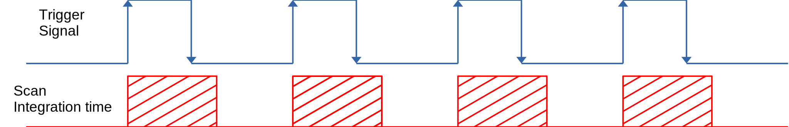

# Thorlabs CCS Spectrometer LabVIEW interface
This project contains a LabVIEW interface for the Thorlabs compact spectrometers (Thorlabs CCS).

## Thorlabs CCS VISA Instrument Drivers
This project uses the official Thorlabs CCS drivers for LabVIEW. Drivers are provided with the instrument or can be downloaded from the [Thorlabs](https://www.thorlabs.com) website. Thorlabs drivers contain a set of VIs with full functionality for communication and control of the instrument.

Once the drivers have been installed, In the LabVIEW IDE the Thorlabs VI drivers can be found in the Tool Palette:

`Instrument I/O : Instr Drivers : TLCCS`

Thorlabs documentation of supported features is available at:

`C:\Program Files\IVI Foundation\VISA\Win64\TLCCS\Manual\TLCCS_files\Thorlabs CCS VISA Instrument Driver.html`

## USB VISA address
The Thorlabs CCS instrument is connected to the PC via USB interface, the Thorlabs LabVIEW driver contains a VI `x_ConnectToUSB.vi` that detects Thorlabs CCS USB instruments connected to the computer. The x_ConnectToUSB.vi VI is not in the instrument palete but can be found in TLCCS.llb:

`C:\Program Files (x86)\National Instruments\LabVIEW xxxx\instr.lib\TLCCS\TLCCS.llb\x_ConnectToUSB.vi`

The x_ConnectToUSB.vi VI searches for all connected USB devices and compares the 'Manufacturer', 'Model' and 'SerialNumber' properties with the input parameters provided. The x_ConnectToUSB.vi works well but is very slow, if 'Manufacturer', 'Model' and 'SerialNumber' are known, the VISA resource name can be used directly. The syntax of the VISA Resource Name is as follows:

`USB0::`USB Manufacturer/Vendor ID`::`USB Model Code/Product ID`::`Device SerialNumber`::RAW`

The VISA Resource Name of the tested Thorlabs CCS200 instrument was:

`USB0::0x1313::0x8089::M00463105::RAW`

Where:
 - USB Manufacturer/Vendor ID = 0x1313 = Thorlabs
 - USB Model Code/Product ID = 0x8089 = CCS200
 - Device SerialNumber = M00463105
 
## External Trigger functionality
Thorlabs CCS instruments support both internal (software) and external (hardware) trigger functionality. For both functionality the instruments can be configured for single scan or continuous acquisition.

Be aware of that the continuous external trigger functionality supported by the Thorlabs CCS instrument is only to initiate or stop a series of scans that reset themselves.

The function tlccs_startScanContExtTrg, VI `TLCCS Start Scan Continuous Ext. Trigger.vi`, arms the CCS for scanning after an external trigger. A subsequent low-to-high transition on the CCS trigger input then starts a scan. The CCS will rearm immediately after the scan data is readout. A following high-to-low transition on the CCS trigger input stops the scan.

If you need to acquire on an external pulse train, this functionality is not natively supported by the instrument.

You can set up a workaround to acquire on an external pulse train. As the high-to-low transition on the CCS trigger input stops the scan, the duty cycle of the trigger pulse should be set shorter than the integration time used. In such a way, the low-to-high transition starts a scan, the following high-to-low transition stops the CCS to rearm after the scan data is readout. As a result, only one scan is acquired for each trigger pulse.

## Example VI
In the Example folder of the project, the routine named `Thorlabs_CCS_Test_Panel.vi` is a ready-to-use test panel VI to acquire and visualize spectra from the Thorlabs CCS instrument.

## Requirements

### Hardware
 - A Thorlabs CCS spectrometer

System tested: `Thorlabs CCS200/M instrument (200 nm–1000 nm, resolution: 0.22 nm)`

### Development environment
 - Nationa Intruments LabVIEW 2021 SP1
 - Thorlabs CCS drivers

## License
This project is licensed under MIT. 
Please see the [LICENSE](LICENSE) file for details.